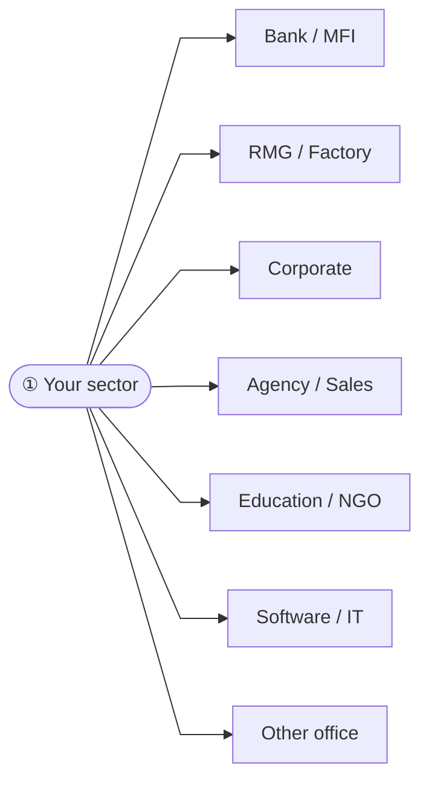
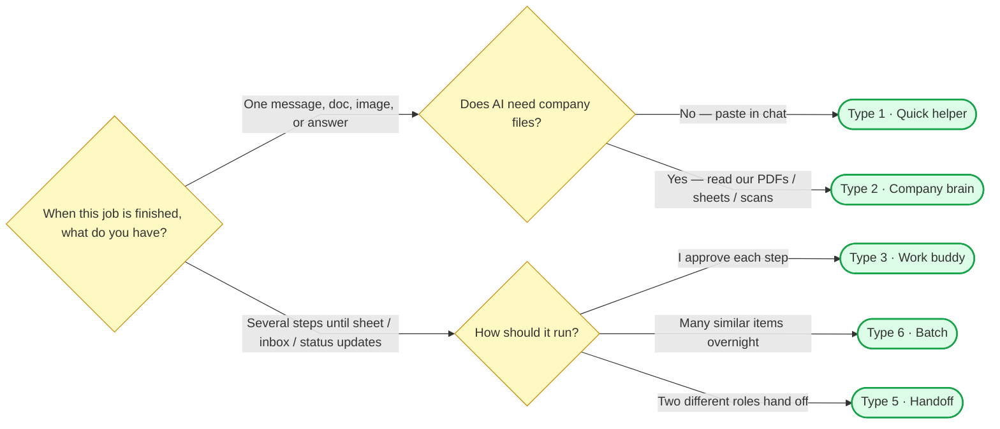

# Find the simplest AI help for your job

You will leave with **one AI pattern** (Type 1–7) that fits a real task from your week — not the flashiest tool.

**How to use (about 10 minutes)**

1. Circle your **sector** (Step 1) and **role** (Step 2).
2. In Step 3, open **only your role’s table**. Circle **one** task number.
3. Follow the **What to do next** column — either a short question (use the Follow-ups chart) or a Type number.
4. Read that Type card. Fill the worksheet on the last page.

---

## The path (left → right)

```mermaid
%%{init: {"flowchart": {"curve": "linear", "padding": 16}} }%%
flowchart LR
  start(["Start"]) --> s1["① Sector"]
  s1 --> s2["② Role"]
  s2 --> s3["③ One task"]
  s3 --> s4["④ Follow-ups"]
  s4 --> s5(["⑤ Your Type 1–7"])

  classDef step fill:#e8f4fc,stroke:#2563eb,stroke-width:2px
  classDef end fill:#dcfce7,stroke:#16a34a,stroke-width:2px
  class s1,s2,s3,s4 step
  class s5 end
```

---

## Step 1 — Which sector are you in?

Circle one.



---

## Step 2 — Which role is closest to your job?

Find your sector. Circle one role. Remember the **table name** it points to for Step 3.

#### Bank / MFI / NBFI / financial services

- **Accounts / finance** → open the **Accounts / finance** table in Step 3
- **Collections / recovery / PAR** → open the **Collections / recovery / PAR** table in Step 3
- **Liability / deposits / funding products** → open the **Sales / business development** table in Step 3
- **Credit / portfolio / risk reporting** → open the **Accounts / finance** table in Step 3
- **Sales / relationship** → open the **Sales / business development** table in Step 3
- **Strategy / research / planning** → open the **Planning / BD / reporting** table in Step 3
- **Operations / customer service / SEO** → open the **Operations / customer care** table in Step 3
- **Team lead / manager / unit head** → open the **Team lead / manager** table in Step 3
- **Executive office / MD coordinator** → open the **Team lead / manager** table in Step 3
- **QA / compliance checker** → open the **QA / evaluation / compliance** table in Step 3

#### RMG / factory / industrial

- **Accounts / finance** → open the **Accounts / finance** table in Step 3
- **HR / admin** → open the **HR / admin** table in Step 3
- **Operations / floor coordination** → open the **Operations / customer care** table in Step 3
- **Supply chain / commercial ops** → open the **Operations / customer care** table in Step 3
- **Planning / reporting** → open the **Planning / BD / reporting** table in Step 3
- **Team lead / manager / DGM+** → open the **Team lead / manager** table in Step 3

#### Corporate office (any industry)

- **Accounts / finance** → open the **Accounts / finance** table in Step 3
- **Portfolio / investment management** → open the **Planning / BD / reporting** table in Step 3
- **Sales / business development** → open the **Sales / business development** table in Step 3
- **Commercial / banking liaison** → open the **Sales / business development** table in Step 3
- **Marketing / communications** → open the **Marketing / communications** table in Step 3
- **Strategy / planning / research** → open the **Planning / BD / reporting** table in Step 3
- **HR / admin** → open the **HR / admin** table in Step 3
- **Operations / customer care** → open the **Operations / customer care** table in Step 3
- **Supply chain / logistics** → open the **Operations / customer care** table in Step 3
- **Team lead / manager** → open the **Team lead / manager** table in Step 3
- **Senior leadership / director / MD office** → open the **Team lead / manager** table in Step 3
- **QA / evaluation** → open the **QA / evaluation / compliance** table in Step 3

#### Agency / sales / distribution

- **Marketing / creative** → open the **Marketing / communications** table in Step 3
- **Sales / client servicing** → open the **Sales / business development** table in Step 3
- **Strategy / BD / planning** → open the **Planning / BD / reporting** table in Step 3
- **Accounts / billing** → open the **Accounts / finance** table in Step 3
- **Operations** → open the **Operations / customer care** table in Step 3
- **Leadership / director / MD** → open the **Team lead / manager** table in Step 3

#### Education / NGO / development

- **Teacher / program staff** → open the **Education / teaching** table in Step 3
- **Program manager / M&E / reporting** → open the **Planning / BD / reporting** table in Step 3
- **HR / admin** → open the **HR / admin** table in Step 3
- **Operations / student support** → open the **Operations / customer care** table in Step 3
- **QA / assessment checker** → open the **QA / evaluation / compliance** table in Step 3

#### Software / IT / digital product

- **Software engineer / developer** → open the **Software engineer / developer** table in Step 3
- **QA / test engineer** → open the **QA / evaluation / compliance** table in Step 3
- **Product / business analyst** → open the **Planning / BD / reporting** table in Step 3
- **Team lead / engineering manager** → open the **Team lead / manager** table in Step 3
- **Sales / presales (IT services)** → open the **Sales / business development** table in Step 3

#### Other office / mixed

- **General office staff** → open the **General office staff** table in Step 3
- **Planning / reporting / admin support** → open the **Planning / BD / reporting** table in Step 3
- **Accounts / finance** → open the **Accounts / finance** table in Step 3
- **Collections / recovery** → open the **Collections / recovery / PAR** table in Step 3
- **HR / admin** → open the **HR / admin** table in Step 3
- **Team lead / manager** → open the **Team lead / manager** table in Step 3


---

## Step 3 — Pick one real task this week

Open **only the table for your role**. Circle one row. Read **What to do next**.

If the next column says “Follow-ups chart,” go to Step 4.  
If it already names **Type 4 / 6 / 7**, skip straight to that Type card.

### Accounts / finance

| # | Your task this week | What “done” looks like | What to do next |
|---|---------------------|------------------------|-----------------|
| 1 | Match bank / bKash / Nagad SMS to Excel | 40 SMS lines vs one sheet—find what does not match before month-end. | Ask yourself: one finished thing, or several steps? → Follow-ups chart |
| 2 | Pull amounts from challan or receipt photos into a sheet | Dealer challan photos → correct amount column for outstanding report. | Ask yourself: one finished thing, or several steps? → Follow-ups chart |
| 3 | Summarize a long audit or policy PDF | 30-page PDF → bullet summary with page references for your manager. | Ask: can I paste in chat, or must AI read company files? → Follow-ups chart |
| 4 | Check payroll or incentive sheet before send | Compare two versions; flag wrong totals or missing names. | Ask yourself: one finished thing, or several steps? → Follow-ups chart |
| 5 | Monthly financial report narrative from the numbers | P&L + cashflow tabs → plain-language summary for CFO with 3 risks called out. | Ask: can I paste in chat, or must AI read company files? → Follow-ups chart |
| 6 | Analyze expense or revenue trends in Excel | 12 months of GL export → top cost drivers and one chart-ready table. | Ask yourself: one finished thing, or several steps? → Follow-ups chart |
| 7 | Clean transaction export before reconciliation | Raw bank/ERP dump → standard columns, no duplicates, ready for VLOOKUP. | Ask yourself: one finished thing, or several steps? → Follow-ups chart |
| 8 | Credit / portfolio risk snapshot for the week | Exposure sheet → concentration, top movers, and 3 questions for the risk meeting. | Ask yourself: one finished thing, or several steps? → Follow-ups chart |

### Collections / recovery / PAR

| # | Your task this week | What “done” looks like | What to do next |
|---|---------------------|------------------------|-----------------|
| 1 | Prioritize overdue accounts for today’s call list | Aging / PAR sheet → Top 20 to call with reason and suggested next action (you still dial). | Ask yourself: one finished thing, or several steps? → Follow-ups chart |
| 2 | Draft polite recovery / reminder message (Bangla or English) | Account facts + tone rules → SMS/WhatsApp/email draft you approve before send. | Ask yourself: one finished thing, or several steps? → Follow-ups chart |
| 3 | Summarize portfolio-at-risk (PAR) movement for leadership | This week vs last week buckets → 1-page narrative + 3 risks for Head of Collections. | Ask: can I paste in chat, or must AI read company files? → Follow-ups chart |
| 4 | Extract promise-to-pay or field notes into a tracker | Call notes / WhatsApp updates → structured sheet: date, amount promised, follow-up. | Ask: I approve each step, or two different roles hand off? → Follow-ups chart |
| 5 | Batch-classify many overdue cases overnight | Hundreds of rows → soft/hard/legal tags by morning; you spot-check a sample. | Your match is **Type 6** (nightly batch) — skip to Types below |
| 6 | Prepare recovery file pack before escalation | Statement + notices + call log → checklist of missing docs for legal/ops handoff. | Ask: can I paste in chat, or must AI read company files? → Follow-ups chart |

### Education / teaching

| # | Your task this week | What “done” looks like | What to do next |
|---|---------------------|------------------------|-----------------|
| 1 | Lesson plan or facilitator notes from syllabus | Syllabus PDF → session plan with activities and timing. | Ask: can I paste in chat, or must AI read company files? → Follow-ups chart |
| 2 | Feedback on student assignments (rubric-based) | 10 submissions scored against pinned rubric; you override edge cases. | Your match is **Type 7** (quality checker) — skip to Types below |
| 3 | Parent or student message drafts in Bangla | Bullet facts → polite message; you send from official account. | Ask yourself: one finished thing, or several steps? → Follow-ups chart |
| 4 | Donor or management program report | Activity data + stories → impact report with numbers you can verify. | Ask: can I paste in chat, or must AI read company files? → Follow-ups chart |
| 5 | Training presentation from module outline | Syllabus bullets → slide titles, activities, and timing for a 2-hour session. | Ask yourself: one finished thing, or several steps? → Follow-ups chart |
| 6 | Clean student or beneficiary data export | Enrollment dump → deduped names, correct grades/districts for M&E sheet. | Ask yourself: one finished thing, or several steps? → Follow-ups chart |

### General office staff

| # | Your task this week | What “done” looks like | What to do next |
|---|---------------------|------------------------|-----------------|
| 1 | Clean up a messy Excel you got on WhatsApp | Wrong columns, merged cells → usable table for your boss. | Ask yourself: one finished thing, or several steps? → Follow-ups chart |
| 2 | Write a formal email, memo, or short report | Bullet points → professional email or 1-page report in Bangla or English. | Ask yourself: one finished thing, or several steps? → Follow-ups chart |
| 3 | Meeting voice note → action items | 15-min recording → who does what by when (you confirm). | Ask yourself: one finished thing, or several steps? → Follow-ups chart |
| 4 | Presentation or slide outline from your notes | Rough bullets → slide titles, one chart suggestion per section, speaker notes. | Ask yourself: one finished thing, or several steps? → Follow-ups chart |
| 5 | Analyze a sheet someone sent you (trends, totals, problems) | “What stands out?” → 5 insights with row references you can check. | Ask yourself: one finished thing, or several steps? → Follow-ups chart |
| 6 | Clean data: duplicates, dates, names, mixed formats | One dirty export → trustworthy table before share or pivot table. | Ask yourself: one finished thing, or several steps? → Follow-ups chart |
| 7 | Organize scattered files on Drive or email | Random attachments → folders, naming rules, and a one-page index. | Ask: I approve each step, or two different roles hand off? → Follow-ups chart |
| 8 | Scan and digitize old paper forms or binders | Paper stack → scanned PDFs with consistent names and a search index. | Your match is **Type 6** (nightly batch) — skip to Types below |
| 9 | Help prepare a demo or briefing for your boss or client | Product screenshots + talking points → demo flow and Q&A prep. | Ask yourself: one finished thing, or several steps? → Follow-ups chart |

### HR / admin

| # | Your task this week | What “done” looks like | What to do next |
|---|---------------------|------------------------|-----------------|
| 1 | Joining letter or offer letter from template + sheet row | One employee row → complete letter with correct dates and salary words. | Ask yourself: one finished thing, or several steps? → Follow-ups chart |
| 2 | Read NID / photo for onboarding checklist | Scan photo → name/ID fields typed for HR file (you verify). | Ask yourself: one finished thing, or several steps? → Follow-ups chart |
| 3 | Attendance or leave sheet cleanup | Mixed attendance export → one clean table for payroll handoff. | Ask yourself: one finished thing, or several steps? → Follow-ups chart |
| 4 | Digitize employee paper files into HR folders | Signed forms and NID copies → scanned, named, indexed in one Drive structure. | Your match is **Type 6** (nightly batch) — skip to Types below |
| 5 | Organize HR policies and letter templates | Scattered Word/PDF files → one handbook folder with version dates. | Ask: I approve each step, or two different roles hand off? → Follow-ups chart |

### Marketing / communications

| # | Your task this week | What “done” looks like | What to do next |
|---|---------------------|------------------------|-----------------|
| 1 | Rewrite ad copy or Facebook post in clear Bangla/English | Campaign brief → 3 caption options under 150 words. | Ask yourself: one finished thing, or several steps? → Follow-ups chart |
| 2 | Fix or resize creatives for social | Old banner → square crop + text readable on mobile. | Ask yourself: one finished thing, or several steps? → Follow-ups chart |
| 3 | Plan a short product video from a brief | Bullets → 30s script + shot list for intern/editor. | Ask yourself: one finished thing, or several steps? → Follow-ups chart |
| 4 | Check claims before publish (compliance pass) | Draft post vs brand rules—flag risky lines before go-live. | Your match is **Type 7** (quality checker) — skip to Types below |
| 5 | Campaign results presentation for leadership | Reach, spend, leads → slide outline + speaker notes for Friday review. | Ask yourself: one finished thing, or several steps? → Follow-ups chart |
| 6 | Organize brand assets and old campaign files | Mixed Drive folders → one library with naming rules and “approved” vs “draft”. | Ask: I approve each step, or two different roles hand off? → Follow-ups chart |

### Operations / customer care

| # | Your task this week | What “done” looks like | What to do next |
|---|---------------------|------------------------|-----------------|
| 1 | Reply to customer ticket using SOP | Angry email + SOP PDF → draft reply you approve before send. | Ask: can I paste in chat, or must AI read company files? → Follow-ups chart |
| 2 | Tag or sort a big inbox overnight | 200 emails → category column by morning; you spot-check 10. | Your match is **Type 6** (nightly batch) — skip to Types below |
| 3 | Coordinate field updates from WhatsApp messages | Daily dealer updates → one master sheet (multi-step, you confirm). | Ask: I approve each step, or two different roles hand off? → Follow-ups chart |
| 4 | Analyze ops or support metrics for weekly report | Ticket export → volume, top issues, SLA misses in bullets for Monday standup. | Ask yourself: one finished thing, or several steps? → Follow-ups chart |
| 5 | Organize SOPs and process docs into one handbook | PDFs in email/Drive chaos → single indexed folder with “current SOP” labels. | Ask: I approve each step, or two different roles hand off? → Follow-ups chart |
| 6 | Clean operational data export before dashboard | Raw CSV from system → fixed dates, categories, and nulls for Sheets dashboard. | Ask yourself: one finished thing, or several steps? → Follow-ups chart |
| 7 | Track supply-chain delays or order exceptions | PO/shipment sheet → late lines, reason codes, and escalation list for South Asia ops standup. | Ask yourself: one finished thing, or several steps? → Follow-ups chart |
| 8 | Draft vendor / logistics follow-up from status sheet | Delayed SKUs + agreed SLA → polite email/WhatsApp you approve before send. | Ask yourself: one finished thing, or several steps? → Follow-ups chart |

### Planning / BD / reporting

| # | Your task this week | What “done” looks like | What to do next |
|---|---------------------|------------------------|-----------------|
| 1 | Write management or board report from notes and numbers | WhatsApp updates + 3 Excel tabs → one 2-page report with highlights and risks. | Ask: can I paste in chat, or must AI read company files? → Follow-ups chart |
| 2 | Build presentation / slide deck for client or internal meeting | Bullet outline + last month’s chart → slide titles, speaker notes, and one chart caption per slide. | Ask yourself: one finished thing, or several steps? → Follow-ups chart |
| 3 | Draft BD plan or market / expansion strategy | Target segment, 5 partners, timeline, and budget rough-cut for leadership review—not a 50-page fantasy doc. | Ask: I approve each step / overnight batch / two roles hand off? → Follow-ups chart |
| 4 | Analyze data for trends, outliers, or top performers | Sales or ops export → “what changed vs last month?” with 5 bullet insights you can defend. | Ask yourself: one finished thing, or several steps? → Follow-ups chart |
| 5 | Clean messy data before analysis or sharing | Duplicate rows, wrong dates, mixed Bangla/English names → one trustworthy table. | Ask yourself: one finished thing, or several steps? → Follow-ups chart |
| 6 | Organize scattered docs into folders + index | Years of Drive/WhatsApp/email attachments → named folders, README index, “official version” tagged. | Ask: I approve each step, or two different roles hand off? → Follow-ups chart |
| 7 | Digitize paper files / binders into searchable archive | Stack of signed forms or old contracts → scans OCR’d, filed, and findable by name/date. | Your match is **Type 6** (nightly batch) — skip to Types below |
| 8 | Prepare real demo product walkthrough (what to show and say) | Live product or prototype → 10-min demo script, click path, and answers to likely client questions. | Ask yourself: one finished thing, or several steps? → Follow-ups chart |
| 9 | Investment / portfolio performance note for stakeholders | Holdings + returns export → plain-language note with risks and next review date. | Ask: can I paste in chat, or must AI read company files? → Follow-ups chart |

### QA / evaluation / compliance

| # | Your task this week | What “done” looks like | What to do next |
|---|---------------------|------------------------|-----------------|
| 1 | Grade AI or agent replies with a rubric | 20 support drafts → pass/fail tags; fails go to senior. | Your match is **Type 7** (quality checker) — skip to Types below |
| 2 | Spot-check overnight batch outputs | 500 tagged rows → sample 15 + exception queue. | Your match is **Type 6** (nightly batch) — skip to Types below |
| 3 | Run fixed checklist / formula checks before asking AI to judge | Totals and required fields first; AI only on the unclear 10%. | Your match is **Type 7** (quality checker) — skip to Types below |

### Sales / business development

| # | Your task this week | What “done” looks like | What to do next |
|---|---------------------|------------------------|-----------------|
| 1 | Bangla follow-up after dealer or client visit | Visit notes → polite WhatsApp message with next step and date. | Ask yourself: one finished thing, or several steps? → Follow-ups chart |
| 2 | Clean product photos for Facebook or catalog | Phone photo → brighter, cropped, ready for post. | Ask yourself: one finished thing, or several steps? → Follow-ups chart |
| 3 | Turn voice note from client into CRM update draft | 2-min Bangla voice note → bullet summary + draft reply (you send). | Ask yourself: one finished thing, or several steps? → Follow-ups chart |
| 4 | Outstanding / pipeline report from messy sheet | Dealer list with mixed formats → clean summary table for Monday meeting. | Ask yourself: one finished thing, or several steps? → Follow-ups chart |
| 5 | BD plan for new territory, product, or partner line | Who to target, visit cadence, and 90-day pipeline goals for your manager. | Ask: I approve each step / overnight batch / two roles hand off? → Follow-ups chart |
| 6 | Client demo script and talk track for a real product | 15-min meeting: opening, 5 screens to show, objection answers, and close ask. | Ask yourself: one finished thing, or several steps? → Follow-ups chart |
| 7 | Win/loss or pipeline analysis from CRM export | Last quarter deals → why we won/lost and where pipeline is stuck. | Ask yourself: one finished thing, or several steps? → Follow-ups chart |
| 8 | Proposal or pitch deck from discovery notes | Visit notes + pricing sheet → client-facing slides and cover email draft. | Ask yourself: one finished thing, or several steps? → Follow-ups chart |
| 9 | Liability / deposit product talking points for a client visit | Rate card + eligibility rules → 1-pager and FAQ you review before the meeting. | Ask: can I paste in chat, or must AI read company files? → Follow-ups chart |
| 10 | Corporate / retail liability pipeline update for leadership | Messy CRM notes → clean funnel table + 5 bullets on stuck deals. | Ask yourself: one finished thing, or several steps? → Follow-ups chart |

### Software engineer / developer

| # | Your task this week | What “done” looks like | What to do next |
|---|---------------------|------------------------|-----------------|
| 1 | Fix failing test or small bug on a branch | Red CI → green tests → PR ready for review. | Your match is **Type 4** (coding helper) — skip to Types below |
| 2 | Ship small feature with review checklist | Ticket → code + tests + PR description; teammate reviews. | Your match is **Type 4** (coding helper) — skip to Types below |
| 3 | Review PR with security + test checklist | AI flags issues; you decide merge—tests must pass. | Your match is **Type 7** (quality checker) — skip to Types below |
| 4 | Build clickable demo or prototype for sales / demo day | Real flows on staging → working demo branch + 5-minute script for presales. | Your match is **Type 4** (coding helper) — skip to Types below |
| 5 | Document API or internal wiki from existing code | Undocumented service → README + endpoint table a new hire can follow. | Ask: can I paste in chat, or must AI read company files? → Follow-ups chart |

### Team lead / manager

| # | Your task this week | What “done” looks like | What to do next |
|---|---------------------|------------------------|-----------------|
| 1 | Weekly team update from scattered notes | Slack/WhatsApp/notes → one manager email with priorities. | Ask yourself: one finished thing, or several steps? → Follow-ups chart |
| 2 | Review team outputs before they go out | Score 10 drafts against team checklist; fail → send back. | Your match is **Type 7** (quality checker) — skip to Types below |
| 3 | Consolidate numbers from 3 departments | Three sheets → one dashboard tab with flagged mismatches. | Ask: I approve each step, or two different roles hand off? → Follow-ups chart |
| 4 | Leadership presentation from team inputs | Dept updates + KPI sheet → board-ready slide outline and speaker notes. | Ask yourself: one finished thing, or several steps? → Follow-ups chart |
| 5 | Quarterly plan or strategy draft for your unit | Goals, budget ask, risks, and milestones in one doc for sign-off. | Ask: I approve each step / overnight batch / two roles hand off? → Follow-ups chart |
| 6 | Monthly performance report from scattered inputs | Email threads + 4 sheets → one manager report with charts described. | Ask: can I paste in chat, or must AI read company files? → Follow-ups chart |
| 7 | Briefing pack for MD / director before a meeting | Emails + KPIs + open issues → 1-page brief with decisions needed (you still own the stamp). | Ask: can I paste in chat, or must AI read company files? → Follow-ups chart |
| 8 | Action tracker after leadership meeting | Messy notes → owners, deadlines, and status table for the MD office follow-up. | Ask yourself: one finished thing, or several steps? → Follow-ups chart |


---

## Step 4 — Follow-up questions → your Type

Use this chart when Step 3 sent you here. Answer the diamonds left → right.

Some tasks skip this chart and go straight to Type 4, 6, or 7 — trust the Step 3 column.



**In words (if the chart does not render):**

1. **When this job is finished, what do you have?**
   - One message, doc, image, or answer → go to question 2  
   - Several steps until a sheet, inbox, or status is updated → go to question 3
2. **Does AI need company files?**
   - No, I can paste in chat → **Type 1**  
   - Yes, it must read our PDFs / sheets / scans → **Type 2**
3. **How should multi-step work run?**
   - I approve each step → **Type 3**  
   - Many similar items overnight → **Type 6**  
   - Two different roles hand off → **Type 5**

---

## Step 5 — Your Type (read the card, then act)

### Type 1 — Quick helper (one finished thing)

You need one good output today—a message, table fix, image tweak, or cleaned transcript. Use AI once, check it yourself, then send or save.

| | |
|--|--|
| **Safety** | Never send money, customer data, or final approvals without reading the output yourself first. |
| **Monday (15 min)** | Open ChatGPT or Claude. Paste your draft + 3 rules (tone, length, Bangla/English). Ask for one improved version. Read aloud once before sending. |

### Type 2 — Company brain (answers from your files)

Your answer should come from company PDFs, sheets, policies, or scanned forms—not from AI guessing. Upload sources, ask with citations, verify tricky answers.

| | |
|--|--|
| **Safety** | If the source doc is wrong or missing, say “I don’t know”—do not invent policy. |
| **Monday (15 min)** | Upload 3–5 key PDFs to NotebookLM or a Claude/ChatGPT Project. Ask today’s question. Click the citation and verify one paragraph. |

### Type 3 — Step-by-step work buddy (you approve each step)

Work runs in steps: collect info → draft or extract → you approve → then update sheet or send message. Best when one job has 3–7 steps and mistakes are costly.

| | |
|--|--|
| **Safety** | Pause before any step that sends money, emails customers, or changes official records. |
| **Monday (15 min)** | Step 1: gather inputs in one doc. Step 2: AI draft. Step 3: you approve. Step 4: paste/send. Log what changed. |

### Type 4 — Coding helper (tests = done)

You ship or fix software. AI helps in the editor; tests (or CI) tell you when it is truly done—not when the model says “fixed.”

| | |
|--|--|
| **Safety** | No production secrets in prompts; no merge without green tests and human review. |
| **Monday (15 min)** | Use AI for commit message + PR description only—code change still goes through tests. |

### Type 5 — Specialist handoff (two different jobs in sequence)

Two genuinely different jobs—e.g. research then Bangla post, or extract invoice then accounts confirmation. Each role has its own tools; pass structured handoffs.

| | |
|--|--|
| **Safety** | Each handoff packet must include sources, numbers, and who approved what. |
| **Monday (15 min)** | Role A: gather bullets with sources. Role B: write customer-facing text from that packet only—no new facts. |

### Type 6 — Nightly batch helper (many similar items)

Same job for dozens or hundreds of rows—receipts, emails, leads, tickets. Run overnight; you spot-check a sample in the morning.

| | |
|--|--|
| **Safety** | Always sample-check 5–10 items before trusting the full batch; keep a failed-items queue. |
| **Monday (15 min)** | Sheets + Zapier/n8n: trigger on new rows; AI tag/draft column; you review sample column next morning. |

### Type 7 — Quality checker (score, then human decides)

Your job is to check AI or human outputs against a fixed checklist—support replies, marketing claims, graded homework, PR reviews. When unsure, send it to a person—do not auto-pass.

| | |
|--|--|
| **Safety** | Never let the same unchecked AI grade its own output—pin the rubric version and keep human override. |
| **Monday (15 min)** | Add tone + factuality checks to marketing drafts. Run before publish. |


---

## Your worksheet

| | Write here |
|--|------------|
| My sector | |
| My role | |
| Task # (from my table) | |
| My **Type 1–7** | |
| **Monday 15-minute action** (copy from your Type card) | |
| **Safety check** before I send / publish | |
